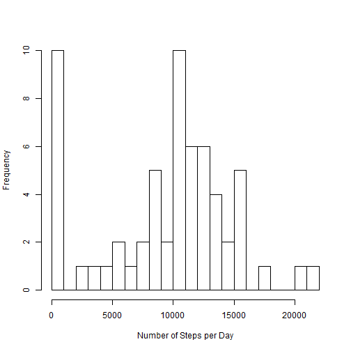
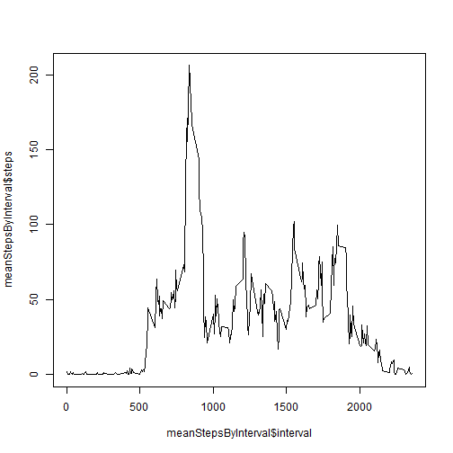
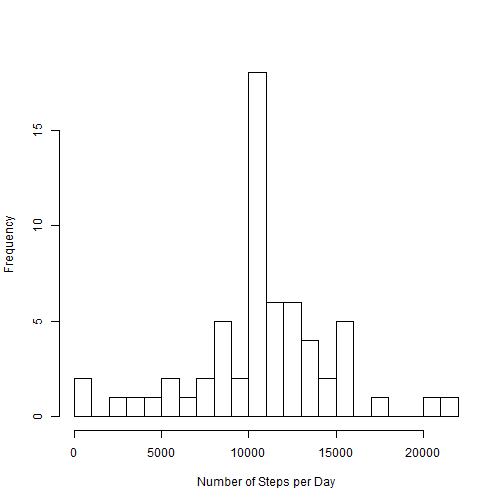

Reproducible Research - Peer Assessment No. 1
========================================================

Loading and preprocessing the data
--------------------------------------------------------

1.Show any code that is needed to load the data (i.e. read.csv())

2.Process/transform the data (if necessary) into a format suitable for your analysis


```r
activity <- read.csv("activity.csv")
```

What is mean total number of steps taken per day?
--------------------------------------------------------

For this part of the assignment, you can ignore the missing values in the dataset.

### 1. Make a histogram of the total number of steps taken each day


```r
stepsPerDay <- aggregate(activity$steps, by=list(activity$date), FUN=sum, 
                         na.rm = T)
names(stepsPerDay) <- c("date", "steps")
hist(stepsPerDay$steps, 20, xlab = "Number of Steps per Day", main = "")
```

 

### 2. Calculate and report the mean and median total number of steps taken per day

#### Mean = 

```r
mean(stepsPerDay$steps, na.rm = T)
```

```
## [1] 9354
```
#### Median = 

```r
median(stepsPerDay$steps, na.rm = T)
```

```
## [1] 10395
```


What is the average daily activity pattern?
----------------------------------------------

### 1. Make a time series plot of the 5-minute interval (x-axis) and the average number of steps taken, averaged across all days (y-axis)

```r
meanStepsByInterval <- aggregate(activity$steps, by=list(activity$interval),
                                FUN=mean, na.rm = T)
names(meanStepsByInterval) <- c("interval", "steps")
plot(meanStepsByInterval$interval, meanStepsByInterval$steps, type = "l")
```

 

### 2. Which 5-minute interval, on average across all the days in the dataset, contains the maximum number of steps?

```r
meanStepsByInterval$interval[which(meanStepsByInterval$steps == 
                              max(meanStepsByInterval$steps, na.rm = T))]
```

```
## [1] 835
```

Imputing missing values
------------------------
Note that there are a number of days/intervals where there are missing values (coded as NA). The presence of missing days may introduce bias into some calculations or summaries of the data.

### Calculate and report the total number of missing values in the dataset (i.e. the total number of rows with NAs)

```r
sum(!complete.cases(activity))
```

```
## [1] 2304
```

### 2. Devise a strategy for filling in all of the missing values

#### Mean number of steps for a given interval will be used to impute missing data. The function "impute" (below) replaces NA with the corresponding mean value


```r
impute <- function(v){
  x <- v[1]
  if (is.na(x) == T) x <- 
    mean(activity$steps[activity$interval == v[2]], na.rm = T)
  return(x)
}
```

### 3. Create a new dataset that is equal to the original dataset but with the missing data filled in.


```r
activity1 <- activity
activity1$steps <- unlist(apply(activity[, c(1,3)], 1, impute))
```

### 4. Make a histogram of the total number of steps taken each day and Calculate and report the mean and median total number of steps taken per day. 

#### Do these values differ from the estimates from the first part of the assignment? What is the impact of imputing missing data on the estimates of the total daily number of steps?


```r
activity1 <- activity
activity1$steps <- unlist(apply(activity[, c(1,3)], 1, impute))
stepsPerDay1 <- aggregate(activity1$steps, by=list(activity1$date),
                         FUN=sum, na.rm = T)
names(stepsPerDay1) <- c("date", "steps")
hist(stepsPerDay1$steps, 20, xlab = "Number of Steps per Day", main = "")
```

 


#### Mean = 

```r
mean(stepsPerDay1$steps, na.rm = T)
```

```
## [1] 10766
```
#### Median =

```r
median(stepsPerDay1$steps, na.rm = T)
```

```
## [1] 10766
```

### The resulting mean and median are greater than those computed on the as-is dataset. Additionally, the new daily number of steps computed with imputed missing data is symmetrically distributed as indicated both by the histogram and the fact that the mean =  equals median.

Are there differences in activity patterns between weekdays and weekends?
-------------------------------------------------------------------------

Use the dataset with the filled-in missing values for this part.

### 1. Create a new factor variable in the dataset with two levels – “weekday” and “weekend” indicating whether a given date is a weekday or weekend day.

#### A simple function "dayType" (below) will take care of this. The new vector will be added to the data frame with imputed missing values as the "dayType" column


```r
dayType <- function(day){
  Day <- "weekday"
  if (day == "Sat" | day == "Sun") Day = "weekend"
  return(Day)
}
activity1$dayType <- as.factor(sapply(weekdays(as.Date(activity1$date), abbreviate = T), dayType))
```

### 2. Make a panel plot containing a time series plot (i.e. type = "l") of the 5-minute interval (x-axis) and the average number of steps taken, averaged across all weekday days or weekend days (y-axis)


```r
meanStepsByInterval12 <- aggregate(activity1$steps, 
    by=list(activity1$interval, activity1$dayType), FUN=mean, na.rm = T)
names(meanStepsByInterval12) <- c("interval", "dayType", "steps")
library("lattice")
xyplot(steps ~ interval | dayType, data = meanStepsByInterval12, type = "l", layout=c(1,2))
```

 
